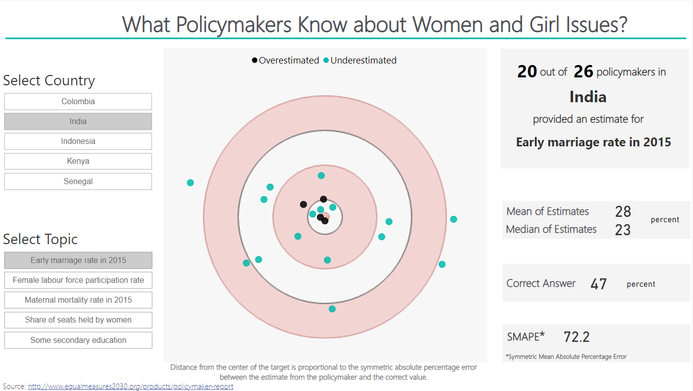

# Data Analysis and Visualization

In this repository I aggregate all the data analysis and visualizations that I published in the internet. 

I included my participations in Storytelling with Data Challenge #SWDchallenge and the Makeover Monday #makeovermonday 

These analysis uses several data sources, including politics, economics and healthcare data.   

### 1. Gasoline price formation in Portugal

I created waterfall chart showing the price breakdown of one liter of gasoline in Portugal. The chart also highlights the taxes paid by the customers at the pump. 

Tableau link: https://public.tableau.com/app/profile/tiago.vinhoza/viz/GasolinePriceinPortugal/PriceBreakdown

### 2. Misery Index in Portugal (1985-2017)

I created a connected scatterplot using unemployment and inflation data from Portugal. The farther a point is from the origin, the larger is the misery index (sum of the unemployment and inflation rates). To add more information to the plot, I chose to encode in the color of the line connecting the dots the information about the party in power during that period of time.

We can see that after the 2009-2011 crisis, the misery index was the same as in the early 90s, but high unemployment was the problem, not high inflation.

### 3. 2016 US presidential election exit poll breakdown 

I used a dot plot to break down the 2016 US presidential election exit polls results according to categories such as gender, age, income and party registration.

### 4. 2018 Brazilian presidential elections

#### 4.1 Runoff scenario simulator

This runoff simulator that I prepared in tableau starts with the results from the first round in Brazil and simulates the vote transfer between from the defeated candidates to Jair Bolsonaro and Fernando Haddad. Some features and assumptions:
* A fixed percentage of the defeated candidates voters will abstain or cast blank votes. 
* A small percentage of voters that abstained in the first round will cast a vote in the second round.
* Three turnout models for the runoff.

#### 4.2 State-by-state results

I used a dot plot to compare the 2018 and 2014 elections results. To get a left-right partisan effect, I picked the x-axis to represent the % of valid votes for the Worker's Party (PT) and reversed it. After that I colored the background of the graphic in red for x>50% and blue for x<50%.

The blue dot represents the 2014 election result and the black dot the 2018 election result. 

Some insights that can be taken from the visualization:
* There was a hard swing to the right
* Bolsonaro flipped 4 states that went for Dilma Roussef in 2014: AM (Amazonas), AP (Amapá), MG (Minas Gerais) and RJ (Rio de Janeiro).
* PT improved their 2014 vote share in 3 states.
* 9 states had swings >10 pts to Bolsonaro.

### 5. 2019 United Kingdom general election

A visualization where each of the 650 constituencies in place for the 2019 general election are described in terms of their competitiveness and their Brexit status

The seat competitiveness was defined in terms of the 2017 election majority:
* battleground: majority less than 5%
* leaning to incumbent: majority between 5% and 10%
* fairly safe: majority between 10% and 20%
* safe: majority greater than 20%.

In terms of the 2016 referendum results, Brexit status was defined as:
* weak remain/leave: share between 50%-55% 
* moderate remain/leave: share between 55%-60%
* strong remain/leave: share greater than 60%

The visualization has two tabs, one showing the status at dissolution and the other showing the post-electoral results. The party information is encoded in the colors. In the post-election tab we used the shape to inform which constituencies changed parties (square - seat flipped, circle - incumbent held seat), there is also a filter that the user can see specifically the open seats (i.e. the incumbent MP not running). 

In the interactive version, hovering over each constituency shows a tooltip that reveals information such as: name, winning party and majority in 2017, leave majority in 2016, seat competiveness, Brexit status, open seat (yes/no).

Tableau link: https://public.tableau.com/app/profile/tiago.vinhoza/viz/2019UKElectionResults/Post-Election

### 6. COVID-19 pandemic data analysis

#### 6.1 Portugal

#### Covid-19 Dashboard
Using streamlit, I created a web app to display and analyze COVID-19 data from Portugal. The Data Science for Social Good initiative fetched the data from the health authorities on a daily basis. I used the files from their repository and made the analysis.

Link to streamlit app: https://share.streamlit.io/tiagotvv/covid19pt/main/CovidPT.py

The app is hosted in another repository of mine. More details about all the information displayed on the dashboard can be found there.
Link to GitHub repo: https://github.com/tiagotvv/covid19pt/

From these data, it is also possible to create insightful plots and animations. In this one, which shows hospitalized patients (total and ICU) versus number of active cases in Portugal, it is possible to see all the 'waves' and the burden they caused on the hospitals.

Data collected from: Data Science for Social Good Portugal: https://github.com/dssg-pt/covid19pt-data

Link to animation (from March 16, 2020 to Dec 30, 2021): https://twitter.com/tiagotvv/status/1476622702932865030

#### Effect of COVID-19 in the overall mortality

All-cause mortality data from Portugal in 2020 e 2021 is comparted to the 2009-2019 period. The data, collected from the Mortality Surveillance Electronic System, shows above average number of deaths staring in March of 2020 and peaking in early 2021.   

Source of mortality data: https://evm.min-saude.pt/

A small animation show the methodology to create the figure above: 
a) start with 2009-2019 data. 
b) take their mean and 25th and 75th percentile values for each day of the uear. 
c) plot 2020 and 2021 data on top of that.

Link to animation: https://www.linkedin.com/posts/tiago-vinhoza_a-mortalidade-em-portugal-nos-anos-de-2020-activity-6891347024567234560-9Kc2?utm_source=linkedin_share&utm_medium=member_desktop_web

#### 6.2 Brazil

The official government data collected at https://covid.saude.gov.br is well structured and organized. It is possible to analyze the data on a national, regional, state, municipal level. It is also possible to analyze the data in terms of health regions (defined by the Ministry of Health). Below I show the results of some of the queries that can be performed on the dataset.

* State level analysis: Heatmap showing the number of deaths per 1 million (cumulative in 14 days) for each state during a 9-month span (July 4, 2020 - April 3, 2021)

* Municipal level queries: Cumulative case and death incidence per 100,000 as of February 2, 2022.

* Health region level queries: Cumulative case and death incidence per 100,000 as of February 2, 2022. In this case it was possible to link to other Ministry of Health databases (https://datasus.saude.gov.br/) and join to the Covid-19 data, information such as number of hospital beds (general and ICU) of each health region.

### 7. What Policymakers know about Women and Girl Issues

This was part of a Makeover Monday challenge: https://www.makeovermonday.co.uk/week10-2018/. A very interesting one, indeed. It was fascinating to see that the policymakers sometimes have no idea about the issues they are tackling. 

Since I wanted to focus on the accuracy aspect of the policymakers, I decided to use a target-style visualization where the distance from the center of the target encodes the information about how accurate (inaccurate) was the estimate by the policy maker. I used the symmetric percentage error to give roughly the same weight to under/overestimates. After defining the distance from the origin, the angle was randomly selected between 0 and 360 degrees to position the marker. I used color to convey the information of how many under/over estimations were made.

Link to interactive dashboard: https://community.powerbi.com/t5/Data-Stories-Gallery/What-Policymakers-know-about-Women-and-Girl-Issues/m-p/372621

### 8. Diagnostic test concepts

I used square area graphs to show diagnostic test concepts such as sensitivity, specificity, positive predictive value (PPV), false omission rate (FOR), true/false positives, true/false negatives, prevalence.

